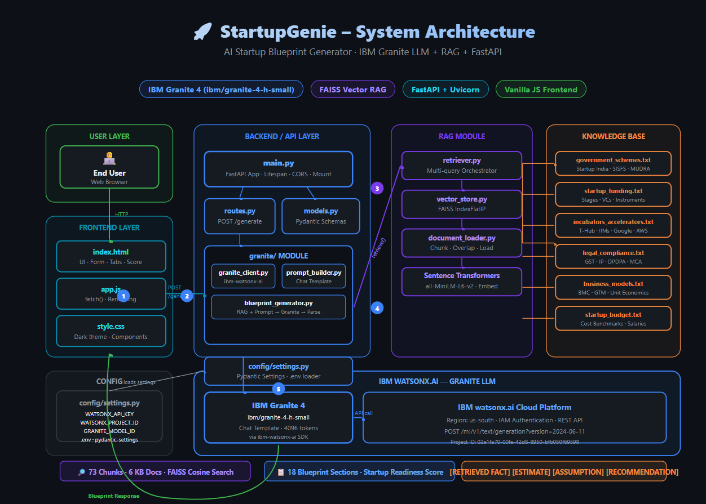

# 🚀 StartupGenie – AI Startup Blueprint Generator

> Transform your raw startup idea into a structured, actionable startup blueprint — powered by **IBM Granite LLM** (via watsonx.ai) and **Retrieval-Augmented Generation (RAG)**.

---

## 📋 Table of Contents

- [Overview](#overview)
- [Features](#features)
- [Architecture](#architecture)
- [Project Structure](#project-structure)
- [Setup & Installation](#setup--installation)
- [Configuration](#configuration)
- [Running the Application](#running-the-application)
- [API Documentation](#api-documentation)
- [RAG Knowledge Base](#rag-knowledge-base)
- [Label System](#label-system)
- [Blueprint Sections](#blueprint-sections)

---

## Overview

**StartupGenie** is a full-stack AI application that accepts a startup idea from the user and generates a comprehensive, 18-section startup blueprint. It uses:

- **IBM Granite** (via IBM watsonx.ai) as the mandatory generative LLM
- **Retrieval-Augmented Generation (RAG)** to ground the output in authoritative startup knowledge
- **FastAPI** for the backend REST API
- A clean, dark-mode **web frontend** for a professional experience

Every generated claim is clearly labelled as:
- `[RETRIEVED FACT]` – grounded in the RAG knowledge base
- `[ESTIMATE]` – financial or quantitative approximation
- `[ASSUMPTION]` – logical inference
- `[RECOMMENDATION]` – strategic advice

---

## Features

| Feature | Detail |
|---|---|
| 🤖 IBM Granite LLM | Generation via `ibm/granite-13b-instruct-v2` on watsonx.ai |
| 🔎 RAG Pipeline | FAISS vector search over 5 authoritative knowledge base documents |
| 📊 18-Section Blueprint | Full startup analysis from idea validation to 90-day action plan |
| ⭐ Readiness Score | 6-dimension startup scoring out of 100 |
| 🏷️ Label System | Clear distinction between facts, estimates, assumptions, recommendations |
| ⚡ FastAPI Backend | RESTful API with Pydantic validation and async request handling |
| 🌐 Web Frontend | Responsive dark-mode UI with section tabs and RAG context viewer |
| 🔄 Retry Logic | Automatic retry with exponential backoff for LLM API calls |
| ⚙️ Config Management | All settings via `.env` file with Pydantic Settings validation |

---

## Architecture

```
User Browser
     │
     ▼
┌─────────────────────────────────┐
│         FastAPI Backend          │
│  ┌──────────┐  ┌──────────────┐ │
│  │  Routes  │  │   Models     │ │
│  └────┬─────┘  └──────────────┘ │
└───────┼─────────────────────────┘
        │
   ┌────┴────────────────────┐
   │                         │
   ▼                         ▼
┌──────────────┐    ┌────────────────────┐
│  RAG Module  │    │  Granite Module     │
│              │    │                    │
│ doc_loader   │    │ granite_client     │
│ vector_store │    │ prompt_builder     │
│ retriever    │    │ blueprint_generator│
└──────┬───────┘    └────────┬───────────┘
       │                     │
       ▼                     ▼
┌─────────────┐    ┌──────────────────────┐
│  Knowledge  │    │  IBM watsonx.ai      │
│    Base     │    │  (Granite LLM)       │
│  (5 .txt    │    └──────────────────────┘
│   files)    │
└─────────────┘
```

**RAG Flow:**
1. At startup, all `.txt` files in `data/knowledge_base/` are loaded and chunked.
2. Each chunk is embedded using `sentence-transformers/all-MiniLM-L6-v2`.
3. Embeddings are stored in an in-memory **FAISS** index.
4. For each user request, a composite query + sub-queries are run against the FAISS index.
5. Top-K relevant chunks are retrieved and formatted as context.
6. Context + user input → IBM Granite → Blueprint.

---

## Project Structure

```
StartUP-Genie/
│
├── main.py                        # FastAPI app entry point
├── requirements.txt               # Python dependencies
├── .env.example                   # Environment variable template
│
├── config/
│   ├── __init__.py
│   └── settings.py                # Pydantic Settings (all env vars)
│
├── backend/
│   ├── __init__.py
│   ├── models.py                  # Pydantic request/response models
│   └── routes.py                  # API route handlers
│
├── rag/
│   ├── __init__.py
│   ├── document_loader.py         # Load & chunk knowledge base docs
│   ├── vector_store.py            # FAISS embedding & search
│   └── retriever.py               # High-level RAG orchestrator
│
├── granite/
│   ├── __init__.py
│   ├── granite_client.py          # IBM watsonx.ai / Granite client
│   ├── prompt_builder.py          # Prompt engineering
│   └── blueprint_generator.py    # RAG + Granite orchestration
│
├── frontend/
│   ├── index.html                 # Main web page
│   └── static/
│       ├── style.css              # Application styles
│       └── app.js                 # Frontend logic
│
└── data/
    └── knowledge_base/
        ├── government_schemes.txt
        ├── startup_funding.txt
        ├── incubators_accelerators.txt
        ├── legal_compliance.txt
        └── business_models.txt
```

---

## Setup & Installation

### Prerequisites
- Python 3.10 or higher
- An IBM Cloud account with a **watsonx.ai** project
- IBM Granite model access (e.g. `ibm/granite-13b-instruct-v2`)

### 1. Clone the repository

```bash
git clone https://github.com/your-username/startup-genie.git
cd startup-genie
```

### 2. Create a virtual environment

```bash
python -m venv venv

# Windows
venv\Scripts\activate

# macOS/Linux
source venv/bin/activate
```

### 3. Install dependencies

```bash
pip install -r requirements.txt
```

> **Note:** First run will download the `all-MiniLM-L6-v2` embedding model (~90 MB) from HuggingFace. This only happens once.

---

## Configuration

### 1. Copy the environment template

```bash
cp .env.example .env
```

### 2. Edit `.env` with your IBM credentials

```env
WATSONX_API_KEY=your_ibm_watsonx_api_key_here
WATSONX_PROJECT_ID=your_watsonx_project_id_here
WATSONX_URL=https://us-south.ml.cloud.ibm.com
GRANITE_MODEL_ID=ibm/granite-13b-instruct-v2
```

### How to get IBM watsonx credentials

1. Sign in to [IBM Cloud](https://cloud.ibm.com).
2. Navigate to **watsonx.ai** and create a project.
3. In your project, click **Manage → General** to find your **Project ID**.
4. Create an **API key** at [IBM Cloud IAM](https://cloud.ibm.com/iam/apikeys).
5. Choose the appropriate regional URL:
   - US South: `https://us-south.ml.cloud.ibm.com`
   - EU DE: `https://eu-de.ml.cloud.ibm.com`
   - JP TOK: `https://jp-tok.ml.cloud.ibm.com`

---

## Running the Application

```bash
# Ensure venv is activated and .env is configured
python main.py
```

The server starts at **http://localhost:8000**.

- **Web UI:** http://localhost:8000/
- **API Docs (Swagger):** http://localhost:8000/api/docs
- **API Docs (ReDoc):** http://localhost:8000/api/redoc

To run with uvicorn directly:

```bash
uvicorn main:app --host 0.0.0.0 --port 8000 --reload
```

---

## API Documentation

### `POST /api/v1/generate`

Generate a complete startup blueprint.

**Request Body:**
```json
{
  "idea": "An AI-powered app connecting local farmers directly with urban consumers",
  "industry": "AgriTech",
  "target_customer": "Urban households aged 25-45 who prefer fresh, organic produce",
  "location": "India",
  "budget": "INR 10 lakh",
  "stage": "Idea Stage"
}
```

**Response:**
```json
{
  "startup_input": { ... },
  "blueprint_raw": "Full text of the blueprint...",
  "sections": {
    "startup_idea_analysis": "...",
    "problem_statement": "...",
    ...
  },
  "retrieved_context": [
    { "content": "...", "source": "government_schemes.txt", "score": 0.87 }
  ],
  "readiness_score": {
    "idea_clarity": 17,
    "market_opportunity": 18,
    ...
    "overall": 78
  },
  "label_counts": {
    "retrieved_facts": 12,
    "estimates": 23,
    "assumptions": 8,
    "recommendations": 31
  },
  "model_used": "ibm/granite-13b-instruct-v2",
  "rag_chunks_retrieved": 15
}
```

### `GET /api/v1/health`

Check system health.

### `GET /api/v1/context?query=...&top_k=5`

Test RAG retrieval directly.

---

## RAG Knowledge Base

| File | Contents |
|---|---|
| `government_schemes.txt` | Startup India, SISFS, AIM, MUDRA, MSME schemes |
| `startup_funding.txt` | Funding stages, investor types, VC firms, term sheet terms |
| `incubators_accelerators.txt` | Y Combinator, T-Hub, IIT Madras, IIM, Google, AWS, NASSCOM |
| `legal_compliance.txt` | Company incorporation, GST, trademarks, patents, DPDPA, compliance calendar |
| `business_models.txt` | BMC, revenue models, market sizing, GTM frameworks, unit economics |

To add more knowledge: simply drop `.txt` files into `data/knowledge_base/` and restart the server.

---

## Label System

Every sentence in the generated blueprint is labelled:

| Label | Meaning | Colour |
|---|---|---|
| `[RETRIEVED FACT]` | Directly sourced from RAG knowledge base | Blue |
| `[ESTIMATE]` | Approximate financial figure or projection | Orange |
| `[ASSUMPTION]` | Logical inference without explicit data | Purple |
| `[RECOMMENDATION]` | Strategic advice from the LLM | Green |

---

## Blueprint Sections

The generated blueprint covers all 18 sections:

1. Startup Idea Analysis
2. Problem Statement
3. Proposed Solution
4. Target Customers
5. Unique Value Proposition
6. Business Model Canvas (all 9 blocks)
7. Market Research (TAM/SAM/SOM)
8. Competitor Analysis
9. Revenue Model
10. Estimated Startup Budget
11. Go-To-Market Strategy
12. Funding Opportunities
13. Government Schemes
14. Legal and Compliance Checklist
15. Incubators and Accelerators
16. Potential Investor Categories
17. 30/60/90 Day Action Plan
18. Startup Readiness Score (out of 100)

---

## Technology Stack

| Component | Technology |
|---|---|
| LLM | IBM Granite 13B Instruct v2 (ibm-watsonx-ai) |
| Embeddings | sentence-transformers (all-MiniLM-L6-v2) |
| Vector Store | FAISS (faiss-cpu) |
| Backend | FastAPI + Uvicorn |
| Validation | Pydantic v2 |
| Config | python-dotenv + pydantic-settings |
| Retry | tenacity |
| Frontend | Vanilla HTML/CSS/JavaScript |

---

*Built as an internship project demonstrating IBM Granite LLM integration with RAG for practical startup advisory applications.*


demo link: http://localhost:8000